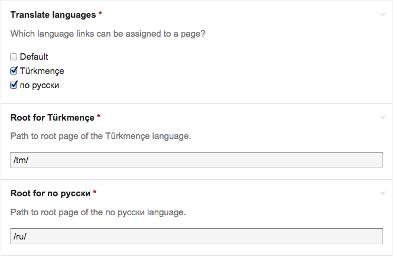

#Babel

Babel is a [ProcessWire][PW] module that provides functionality for managing 
section based multilanguage sites. It is inspired by [Babel Plugin][Babel MODX] for [MODX][MODX].

[PW]:           https://processwire.com "Open source CMS with a great API–ProcessWire CMF/CMS"
[Babel MODX]:   http://rtfm.modx.com/extras/revo/babel
[MODX]:         http://modx.com/

## How to Install

1. Copy all the files in this directory to /site/modules/Babel/ 

2. In your admin, go to Modules > Check for new modules. 

3. Click the "Install" button next to Babel.


## Settings

First of all you should set the root page for each language.


Usually multilingual sites will have a structure like...

```
Root
  |__Home (English)
       |__About
       |__News
           |__ News Article 1
           |__ News Article 2
           |__ News Article 3
           |__ News Article 4
       |__Contact
       ...
  |__Главная (Russian)
       |__О нас
       |__Новости
           |__ Новостная статья 1
           |__ Новостная статья 2
           |__ Новостная статья 3
           |__ Новостная статья 4
       |__Связаться
       ...
  |__Baş (Turkmen)
       |__Barada
       |__Habarlar
           |__ Habar Makalasy 1
           |__ Habar Makalasy 2
           |__ Habar Makalasy 3
           |__ Habar Makalasy 4
       |__Aragatnaşyk
       ...
```
All you need to do is to link already existing pages as translations to each 
other and Babel will try to figure out where should the new pages be created when 
new translations are needed.


## API
Babel creates couple useful methods and properties on `$page` object for you.

### translation Method
This method returns one page that was assigned as a translation for the given `$language`.

##### Syntax
  $page->translation($language);

##### Arguments
The method accepts only one argument. The `$language` argument could be either a 
`string` (the name of the language), an `integer` (the id of the language) or a 
Language object itself.

##### Throws
`WireException` if the language is not found or isn't handled by Babel.

##### Return
The method returns a `Page` object or `NullPage` if the translation is not available.

### translations Method
This method will return the pages that were assigned as a translation for all `$languages`.
Or an empty `WireArray` if no translations are available.

#####Syntax
  $page->translations();

#####Return
Returns `PageArray`.

### addTranslation Method
This method will create a translation link to the given page if not already exists or 
overwrite if otherwise.

##### Syntax
  $page->addTranslation($otherPage);

##### Arguments
The `$otherPage` argument should be a `Page` object. The language of the page
will be determined by Babel itself based on under which language section the 
page is located.

##### Return
`booleaan` if the translation link is created successfully or not.

### removeTranslation Method
The method removes a translation link between `$page` and `$otherPage`.

#####Syntax
  $page->removeTranslation($language, $remove);

#####Arguments
`$language` (`string|integer|Language`) The language link you wish to remove.
`$remove` (`boolean`) If there is a reverse link that points back from the 
translation to this page, should Babel remove it.

#####Return
`boolean` If the removal of the translation link is successful.

### language Property
Every page that is handled by Babel (those who are decendents of root pages that 
you choose on Babel module's settings page) will have a `language` property that
stores a `Language` object that they are assigned to. E.g. let say you have two 
language sections for your site. English and Spanish. And two languages created
on `Setup => Languages` also `English (default)` and `Spanish (es)`. Each page under
English language section will have a property `language` that is a `Language` object
of `Setup => Languages => English(default)`.

### Contents
[TOC]