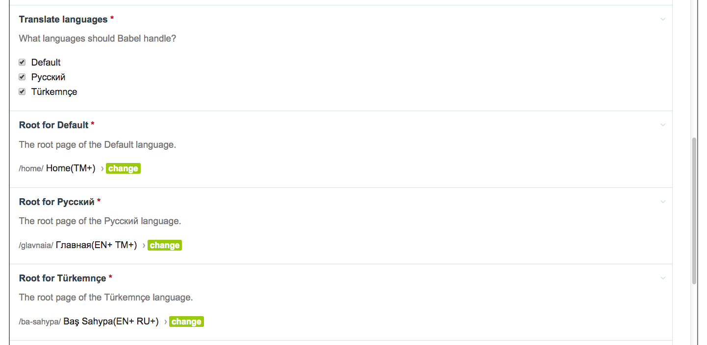
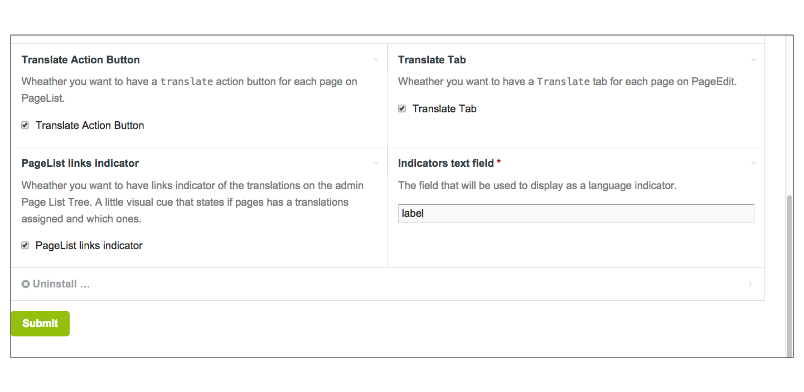
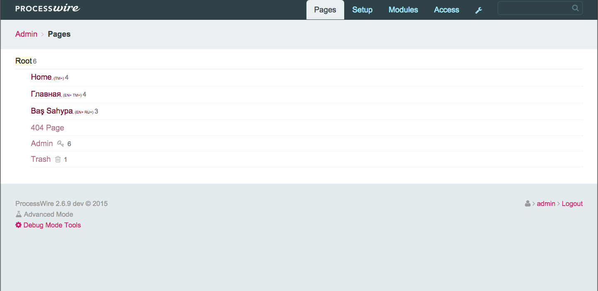
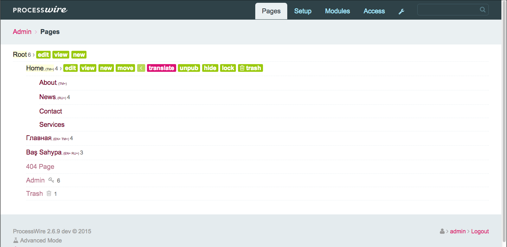
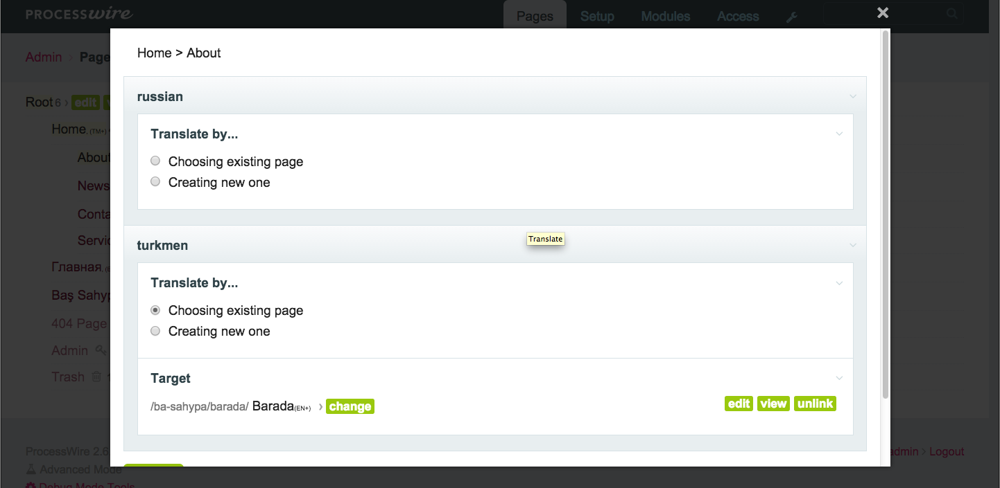
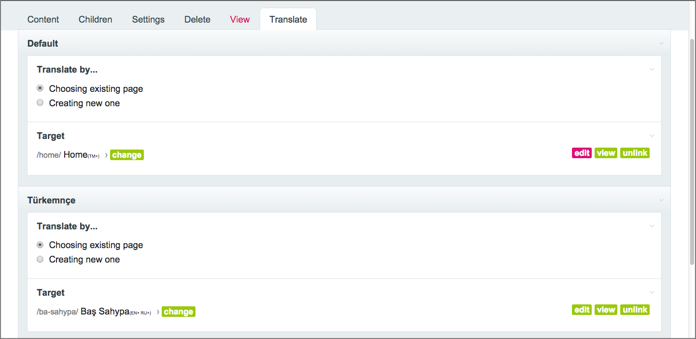
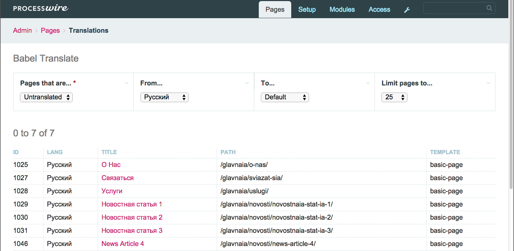

#Babel

Babel is a [ProcessWire][PW] module that provides functionality for managing 
section based multilanguage sites. It is inspired by [Babel Plugin][Babel MODX] for [MODX][MODX].

[PW]:           https://processwire.com "Open source CMS with a great API–ProcessWire CMF/CMS"
[Babel MODX]:   http://rtfm.modx.com/extras/revo/babel
[MODX]:         http://modx.com/

## How to Install

1. Copy all the files in this directory to /site/modules/Babel/ 

2. In your admin, go to Modules > Check for new modules. 

3. Click the "Install" button next to Babel.


## Settings

First of all you should set the root page for each language.
Usually section based multilingual sites will have a structure like...

```
Root
  |__Home (English)
       |__About
       |__News
           |__ News Article 1
           |__ News Article 2
           |__ News Article 3
           |__ News Article 4
       |__Contact
       ...
  |__Главная (Russian)
       |__О нас
       |__Новости
           |__ Новостная статья 1
           |__ Новостная статья 2
           |__ Новостная статья 3
           |__ Новостная статья 4
       |__Связаться
       ...
  |__Baş Sahypa (Turkmen)
       |__Barada
       |__Habarlar
           |__ Habar Makalasy 1
           |__ Habar Makalasy 2
           |__ Habar Makalasy 3
           |__ Habar Makalasy 4
       |__Aragatnaşyk
       ...
```
You just need to select the languages that you want Babel to manage and 
select the root pages for each of them.



## API
Babel creates couple useful methods and a property on `$page` object for you.


### language (Page property)
Every page that is handled by Babel (those who are decendents of root pages that 
you choose on Babel module's settings page) will have a `language` property that
returns a `Language` object that they are assigned to. It is determined based on
under which rootParent the `$page` lives;
##### Syntax
```
$page->language;
```
##### Return
`Language` object.


### translation (Page method)
This method returns the page that was assigned as a translation for the given `$language`.

##### Syntax
```
$page->translation($language);
```
##### Arguments
The `$language` argument could be either a `string` (the name of the language), 
an `integer` (the id of the language) or a `Language` object itself.
##### Throws
`WireException` if the language is not found or isn't handled by Babel.
##### Return
The method returns a `Page` object or `NullPage` if the translation is not available.


### translations (Page method)
This method will return the pages that were assigned as a translation for all `$languages`.
Or an empty `PageArray` if no translations are available.
#####Syntax
```
$page->translations();
```
#####Return
Returns `PageArray`.


### addTranslation (Page method)
This method will create a translation link from `$page` to `$otherPage`.
##### Syntax
```
$page->addTranslation($otherPage, $overwrite);
```
##### Arguments
The `$otherPage` argument should be a `Page` object. The language of the page
will be determined by Babel itself based on under which language section the 
page is located.
The `$overwrite` argument is optional and has three case scenarios:
-- If omitted the reverse link of the translation will be created only 
if the `$otherPage` does not have a translation link for the `$page->language`. 
-- If set to `true` the reverse link will be overwitten even if `$otherPage`
does have a translation link for the `$page->language`.
-- If set to `false` the reverse translation link will not be created even if
the `$otherPage` does not have any translation links.
##### Return
`boolean` if the translation link/s is/are created successfully or not.


### removeTranslation (Page method)
The method removes a translation link between `$page` and `$otherPage`.
#####Syntax
```
$page->removeTranslation($language, $remove);
```
#####Arguments
`$language` (`string|integer|Language`) The language link you wish to remove.
`$remove` (`boolean`) If there is a reverse link that points back from the 
translation to this page, should Babel remove it too. Default is `false`.
##### Throws
Throws `WireException` if the language couldn't be found or is not handled by Babel.
#####Return
`boolean` If the removal of the translation link/s is/are successful.


### closestParentTranslation (Page method)
Returns the translation of the closests translatable parent of the page.
##### Syntax
```
$page->closestParentTranslation($language);
```
##### Arguments
`$language` (`string|integer|Language`) The language for which you want a 
translation for.
##### Throws
Throws `WireException` if the language couldn't be found or is not handled by Babel.
##### Return
`Page` object.


### getRoot (Babel method)
Returns the rootPage of the language. The one you have assigned in the module settings
page.
#####Syntaxt
```
$modules->get('Babel')->getRoot($language);
```
#####Arguments
`$language` (`string|integer|Language`) The language link you wish to remove.
#####Throws
Throws `WireException` if the language couldn't be found or is not handled by Babel.
#####Return
`Page` object.


### translatable (Babel method)
Tells if a page is translatable via Babel or not.
#####Syntax
```
$modules->get('Babel')->translatable($page);
```
#####Arguments
`$page` is a `Page` object. The page you want to check on.
#####Return
`boolean` If the page is translatable or not.


###getTranslated (Babel method)
Returns a PageArray of translated pages. 
#####Syntax
```
$modules->get('Babel')->getTranslated($fromLanguage, $toLanguage, $limit, $pageNum);
```
#####Arguments
`$fromLanguage` (`string|integer|Language`) The language __from__ which the translation is.
If omitted (or `null` given) then all the translation __from__ all languages will be considered.
`$toLanguage` (`string|integer|Language`) The language __to__ which the translation is.
If omitted (or `null` given) then translation __to__ all languages will be considered.
`$limit` is the number of pages you want to recieve. Default is 50.
`$pageNum` is the page number. Use for pagination of the returned `PageArray`.
 Default is 1.
#####Throws
Throws `WireException` if the language couldn't be found or is not handled by Babel.
#####Return
`PageArray`.

###getUntranslated (Babel method)
Returns a PageArray of pages that are not translated to one or the other language.
#####Syntax
```
$modules->get('Babel')->getTranslated($fromLanguage, $toLanguage, $limit, $pageNum);
```
#####Arguments
`$fromLanguage` (`string|integer|Language`) The language from which there is no translation.
If omitted (or `null` given) then all the untranslated pages from any language will be
considered.
`$toLanguage` (`string|integer|Language`) The language to which there is no translation.
If omitted (or `null` given) then untranslated pages to any language will be considered.
`$limit` is the number of pages you want to recieve. Default is 50.
`$pageNum` is the page number.  Use for pagination of the returned PageArray.
Default is 1.
#####Throws
Throws `WireException` if the language couldn't be found or is not handled by Babel.
#####Return
`PageArray`.


##ProcessBabelTranslate
Babel comes with very useful admin helper. You can link pages as a translation for
each other. You can create translation page if there isn't one yet. There is small 
indicators on page tree that shows which pages are translated to what languages.
And you get a Babel Tanslate page where you can quickly find all the translated 
and untranslated pages accross your site. See the screenshots below...

######Settings page


######Translation indicators


######Quick action button


######Quick modal translate form


######Tab translate form


######ProcessBabelTranslate page





##License

This program is free software; you can redistribute it and/or modify it under the terms of the GNU General Public License as published by the Free Software Foundation; either version 2 of the License, or (at your option) any later version.

This program is distributed in the hope that it will be useful, but WITHOUT ANY WARRANTY; without even the implied warranty of MERCHANTABILITY or FITNESS FOR A PARTICULAR PURPOSE. See the GNU General Public License for more details.

You should have received a copy of the GNU General Public License along with this program; if not, write to the Free Software Foundation, Inc., 51 Franklin Street, Fifth Floor, Boston, MA 02110-1301, USA.

(See included LICENSE file for full license text.)